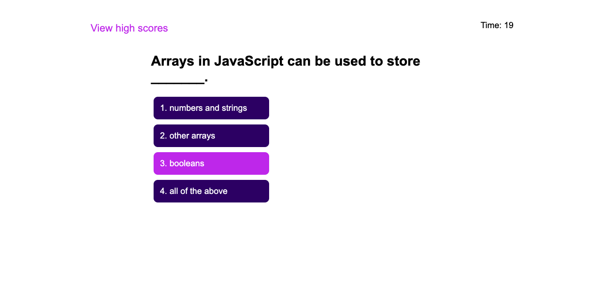

# timed-quiz-JS

## Goal
The goal of this assignment was to create a dynamic, interactive webpage from scratch that would allow the user to play a timed and scored quiz game. Upon completion, the user will be able to save their score to a leaderboard stored local to their device. This website utilizes a barebones .html page, populated dynamically with javascript and jQuery. CSS is used to create a consistent, user friendly interface.

https://austibb.github.io/timed-quiz-JS/

https://github.com/austibb/timed-quiz-JS